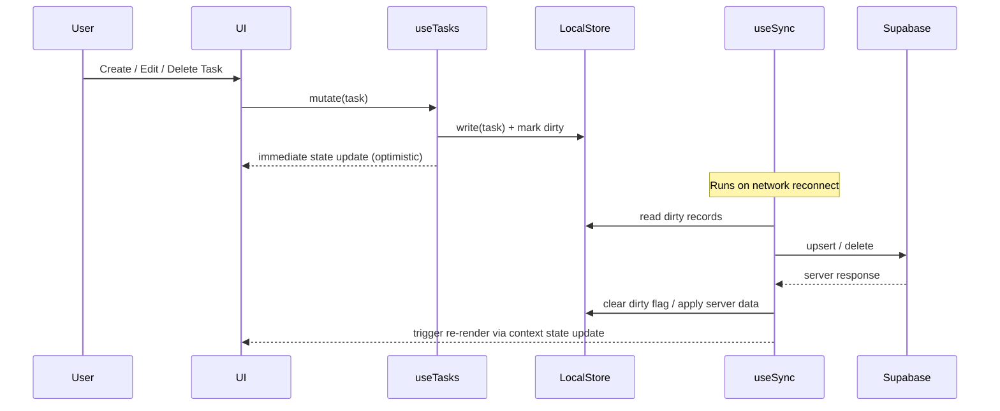
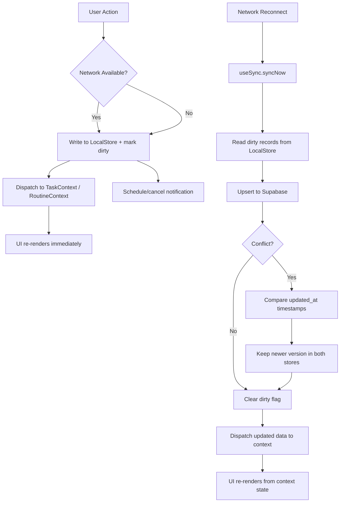
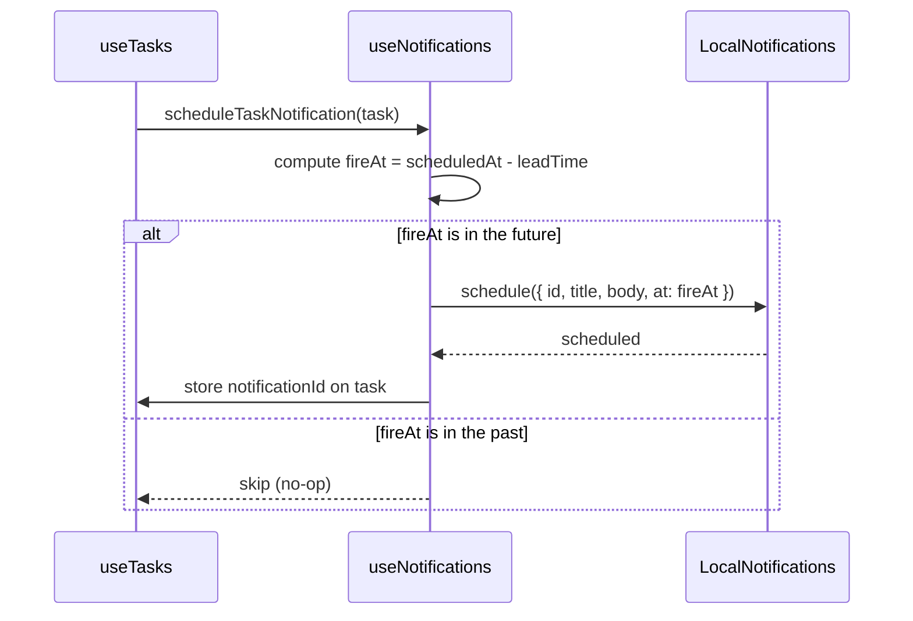

# Design Document: Task Reminder and Daily Routine Management App

## Overview

This document describes the technical architecture and design for a cross-platform mobile application built with **Ionic React + Capacitor + Supabase**. The app enables users to manage tasks, daily routines, and habits with offline-first support, local notifications, and cloud synchronization.

The design follows an **offline-first** philosophy: all reads and writes go to the local store first, and a background sync hook reconciles changes with Supabase when connectivity is available. Notifications are scheduled entirely on-device using `@capacitor/local-notifications`, ensuring reminders fire even without a network connection.

---

## Technology Stack

### Pinned Package Versions

All versions are explicitly pinned to ensure compatibility and reproducibility.

```json
{
  "dependencies": {
    "@ionic/react": "8.4.2",
    "@ionic/react-router": "8.4.2",
    "react": "18.3.1",
    "react-dom": "18.3.1",
    "react-router": "5.3.4",
    "react-router-dom": "5.3.4",
    "@capacitor/android": "7.2.0",
    "@capacitor/app": "7.0.1",
    "@capacitor/core": "7.2.0",
    "@capacitor/haptics": "7.0.1",
    "@capacitor/ios": "7.2.0",
    "@capacitor/keyboard": "7.0.1",
    "@capacitor/local-notifications": "7.0.1",
    "@capacitor/network": "7.0.1",
    "@capacitor/preferences": "7.0.1",
    "@capacitor/push-notifications": "7.0.1",
    "@capacitor/status-bar": "7.0.1",
    "@supabase/supabase-js": "2.45.4",
    "@aparajita/capacitor-biometric-auth": "7.0.2",
    "ionicons": "7.4.0"
  },
  "devDependencies": {
    "@capacitor/cli": "7.2.0",
    "@testing-library/react": "16.3.0",
    "@testing-library/user-event": "14.5.2",
    "@types/react": "18.3.12",
    "@types/react-dom": "18.3.1",
    "@types/react-router": "5.1.20",
    "@types/react-router-dom": "5.3.3",
    "@vitejs/plugin-react": "4.3.4",
    "typescript": "5.5.4",
    "vite": "5.4.11",
    "vitest": "2.1.8",
    "fast-check": "3.22.0",
    "jsdom": "25.0.1"
  }
}
```

**Compatibility rationale:**
- `@ionic/react` 8.x requires React 18; `react` 18.3.1 is the latest stable React 18 patch.
- React Router v5 (`react-router` 5.3.4) is what `@ionic/react-router` 8.x uses internally — do **not** use React Router v6.
- Capacitor 7.2.0 is the latest stable Capacitor 7 release; all `@capacitor/*` plugins at `7.0.1` are the first stable Capacitor-7-compatible releases.
- `@supabase/supabase-js` 2.45.4 is a stable 2.x release with full TypeScript support.
- `@aparajita/capacitor-biometric-auth` 7.x targets Capacitor 7.
- Vitest 2.1.8 + React Testing Library 16.3.0 work with React 18.
- `fast-check` 3.22.0 is used for property-based testing.
- Node.js 20 LTS is required (Capacitor 7 minimum).

---

## Architecture

### High-Level Architecture

```mermaid
graph TD
    subgraph Mobile App (Ionic React + Capacitor)
        UI[UI Layer<br/>Ionic Components / React Pages & Components]
        Hooks[Hook Layer<br/>useTasks / useRoutines / useAuth<br/>useNotifications / useSync / useProgress / useTheme]
        Context[Context Layer<br/>TaskContext / AuthContext / ThemeContext / SyncContext]
        LocalStore[Local Store<br/>@capacitor/preferences (JSON-based)]
        CapPlugins[Capacitor Plugins<br/>LocalNotifications / Network / BiometricAuth]
    end

    subgraph Cloud (Supabase)
        SupaAuth[Supabase Auth]
        SupaDB[PostgreSQL Database]
        SupaRealtime[Realtime Subscriptions]
    end

    UI --> Hooks
    Hooks --> Context
    Hooks --> LocalStore
    Hooks --> CapPlugins
    Hooks --> SupaAuth
    Hooks --> SupaDB
    SupaRealtime --> Hooks
```

### Offline-First Data Flow



### Component Diagram

```mermaid
graph LR
    subgraph React Pages & Components
        Auth[AuthPage]
        Home[HomePage / Dashboard]
        Tasks[TaskListPage]
        TaskDetail[TaskDetailPage]
        Routines[RoutinePlannerPage]
        Calendar[CalendarPage]
        Progress[ProgressPage]
        Settings[SettingsPage]
    end

    subgraph Custom Hooks
        AH[useAuth]
        TH[useTasks]
        RH[useRoutines]
        NH[useNotifications]
        SH[useSync]
        PH[useProgress]
        ThH[useTheme]
        NetH[useNetwork]
    end

    subgraph Capacitor Plugins
        LN[@capacitor/local-notifications]
        NET[@capacitor/network]
        BIO[@aparajita/capacitor-biometric-auth]
        PREF[@capacitor/preferences]
    end

    subgraph Context Providers
        TC[TaskContext]
        AC[AuthContext]
        ThC[ThemeContext]
        SC[SyncContext]
    end

    Auth --> AH
    Home --> TH & RH & PH
    Tasks --> TH & NH
    TaskDetail --> TH & NH
    Routines --> RH & NH
    Calendar --> TH & RH
    Progress --> PH
    Settings --> AH & ThH & NH

    AH --> AC & PREF & BIO
    TH --> TC & NH & SH
    RH --> TC & NH & SH
    NH --> LN
    SH --> SC & NET
    PH --> TC
    ThH --> ThC & PREF
    NetH --> NET
```

---

## Components and Interfaces

### Navigation Structure

```
/auth
  /login
  /register
  /forgot-password

/app (authenticated, tab-based — IonTabs)
  /tabs
    /home          → Dashboard (today's tasks + routines)
    /tasks         → Task list with filter/sort
    /routines      → Daily routine planner
    /calendar      → Calendar view (monthly/weekly)
    /progress      → Progress tracking & stats

/task-detail/:id   → Task create/edit/view
/routine-detail/:id → Routine create/edit/view
/settings          → App settings
```

React Router v5 is used via `@ionic/react-router`. Route definitions live in `App.tsx` using `IonReactRouter`, `IonRouterOutlet`, and `IonTabs`.

### Custom Hook Interfaces

```typescript
// useAuth — replaces AuthService
function useAuth(): {
  user: User | null;
  loading: boolean;
  register: (email: string, password: string) => Promise<void>;
  login: (email: string, password: string) => Promise<void>;
  loginWithBiometrics: () => Promise<void>;
  logout: () => Promise<void>;
  resetPassword: (email: string) => Promise<void>;
}

// useTasks — replaces TaskService
function useTasks(filters?: TaskFilter): {
  tasks: Task[];
  loading: boolean;
  createTask: (dto: CreateTaskDto) => Promise<Task>;
  updateTask: (id: string, changes: Partial<Task>, scope: RecurrenceScope) => Promise<Task>;
  deleteTask: (id: string, scope: RecurrenceScope) => Promise<void>;
  markComplete: (id: string, complete: boolean) => Promise<void>;
}

// useRoutines — replaces RoutineService
function useRoutines(): {
  routines: Routine[];
  loading: boolean;
  createRoutine: (dto: CreateRoutineDto) => Promise<Routine>;
  updateRoutine: (id: string, changes: Partial<Routine>) => Promise<Routine>;
  deleteRoutine: (id: string) => Promise<void>;
  addHabit: (routineId: string, habit: CreateHabitDto) => Promise<Habit>;
  markHabitComplete: (habitId: string, complete: boolean) => Promise<void>;
}

// useNotifications — replaces NotificationScheduler
function useNotifications(): {
  scheduleTaskNotification: (task: Task) => Promise<void>;
  cancelTaskNotification: (taskId: string) => Promise<void>;
  scheduleRoutineNotification: (routine: Routine) => Promise<void>;
  cancelRoutineNotification: (routineId: string) => Promise<void>;
  cancelAll: () => Promise<void>;
  setGlobalEnabled: (enabled: boolean) => Promise<void>;
}

// useSync — replaces SyncService
function useSync(): {
  syncNow: () => Promise<SyncResult>;
  syncStatus: SyncStatus;
  pendingChanges: number;
}

// useProgress — replaces ProgressTracker
function useProgress(): {
  getDailySummary: (date: Date) => DailySummary;
  streakCount: number;
  weeklyChart: DailyCount[];
  recordCompletion: (taskId: string, completed: boolean) => Promise<void>;
}

// useTheme — replaces ThemeService
function useTheme(): {
  theme: 'light' | 'dark' | 'system';
  setTheme: (theme: 'light' | 'dark' | 'system') => Promise<void>;
}

// useNetwork — replaces NetworkService
function useNetwork(): {
  isOffline: boolean;
  connectionType: string;
}
```

### Context Providers

Global state is managed through React Context + `useReducer`. The provider tree in `App.tsx`:

```tsx
<AuthProvider>        {/* AuthContext — current user, session */}
  <ThemeProvider>     {/* ThemeContext — theme preference */}
    <SyncProvider>    {/* SyncContext — sync status, pending count */}
      <TaskProvider>  {/* TaskContext — task list state via useReducer */}
        <App />
      </TaskProvider>
    </SyncProvider>
  </ThemeProvider>
</AuthProvider>
```

`TaskContext` uses `useReducer` with actions: `SET_TASKS`, `ADD_TASK`, `UPDATE_TASK`, `DELETE_TASK`, `MARK_COMPLETE`. `useEffect` hooks inside providers handle side effects such as network status listeners, app state listeners, and Supabase Realtime subscriptions.

---

## Data Models

### TypeScript Interfaces

```typescript
// Enums
export type Priority = 'high' | 'medium' | 'low';
export type Category = 'school' | 'work' | 'personal' | 'health';
export type TimeBlock = 'morning' | 'afternoon' | 'evening';
export type RecurrenceType = 'none' | 'daily' | 'weekly' | 'monthly' | 'selected_days';
export type RecurrenceScope = 'this' | 'future' | 'all';
export type LeadTime = 5 | 10 | 15 | 30 | 60; // minutes

export interface Task {
  id: string;                        // UUID
  userId: string;
  title: string;                     // non-empty, required
  scheduledAt: string;               // ISO 8601 datetime
  priority: Priority;                // default: 'medium'
  category: Category;                // default: 'personal'
  recurrenceType: RecurrenceType;    // default: 'none'
  recurrenceDays?: number[];         // 0=Sun..6=Sat for 'selected_days'
  recurrenceGroupId?: string;        // links recurring instances
  reminderLeadTime: LeadTime;        // default: 15
  isCompleted: boolean;
  completedAt?: string;
  notificationId?: number;           // Capacitor local notification ID
  isDirty: boolean;                  // pending sync
  isDeleted: boolean;                // soft delete for sync
  createdAt: string;
  updatedAt: string;
}

export interface Routine {
  id: string;
  userId: string;
  name: string;                      // non-empty, required
  timeBlock: TimeBlock;
  recurrenceType: RecurrenceType;
  recurrenceDays?: number[];
  reminderLeadTime: LeadTime;
  notificationId?: number;
  isDirty: boolean;
  isDeleted: boolean;
  createdAt: string;
  updatedAt: string;
  habits?: Habit[];                  // populated on read
}

export interface Habit {
  id: string;
  routineId: string;
  userId: string;
  name: string;
  isCompleted: boolean;
  completedAt?: string;
  isDirty: boolean;
  createdAt: string;
  updatedAt: string;
}

export interface TaskCompletion {
  id: string;
  taskId: string;
  userId: string;
  completedAt: string;               // ISO 8601
  date: string;                      // YYYY-MM-DD for daily aggregation
}

export interface UserPreferences {
  userId: string;
  notificationsEnabled: boolean;
  defaultLeadTime: LeadTime;
  theme: 'light' | 'dark' | 'system';
  biometricEnabled: boolean;
}

// DTOs
export interface CreateTaskDto {
  title: string;
  scheduledAt: string;
  priority?: Priority;
  category?: Category;
  recurrenceType?: RecurrenceType;
  recurrenceDays?: number[];
  reminderLeadTime?: LeadTime;
}

export interface TaskFilter {
  priorities?: Priority[];
  categories?: Category[];
  date?: string;
  completed?: boolean;
}

export interface DailySummary {
  date: string;
  scheduled: number;
  completed: number;
  percentage: number;
}

export interface DailyCount {
  date: string;
  completed: number;
}

export interface SyncResult {
  pushed: number;
  pulled: number;
  conflicts: number;
  errors: string[];
}

export type SyncStatus = 'idle' | 'syncing' | 'error' | 'offline';
```

### Supabase PostgreSQL Schema

```sql
-- Enable UUID extension
CREATE EXTENSION IF NOT EXISTS "uuid-ossp";

-- Users table (managed by Supabase Auth, extended via profiles)
CREATE TABLE profiles (
  id          UUID PRIMARY KEY REFERENCES auth.users(id) ON DELETE CASCADE,
  email       TEXT NOT NULL,
  created_at  TIMESTAMPTZ NOT NULL DEFAULT NOW(),
  updated_at  TIMESTAMPTZ NOT NULL DEFAULT NOW()
);

-- User preferences
CREATE TABLE user_preferences (
  user_id                UUID PRIMARY KEY REFERENCES profiles(id) ON DELETE CASCADE,
  notifications_enabled  BOOLEAN NOT NULL DEFAULT TRUE,
  default_lead_time      SMALLINT NOT NULL DEFAULT 15
                           CHECK (default_lead_time IN (5, 10, 15, 30, 60)),
  theme                  TEXT NOT NULL DEFAULT 'system'
                           CHECK (theme IN ('light', 'dark', 'system')),
  biometric_enabled      BOOLEAN NOT NULL DEFAULT FALSE,
  updated_at             TIMESTAMPTZ NOT NULL DEFAULT NOW()
);

-- Tasks
CREATE TABLE tasks (
  id                  UUID PRIMARY KEY DEFAULT uuid_generate_v4(),
  user_id             UUID NOT NULL REFERENCES profiles(id) ON DELETE CASCADE,
  title               TEXT NOT NULL CHECK (char_length(trim(title)) > 0),
  scheduled_at        TIMESTAMPTZ NOT NULL,
  priority            TEXT NOT NULL DEFAULT 'medium'
                        CHECK (priority IN ('high', 'medium', 'low')),
  category            TEXT NOT NULL DEFAULT 'personal'
                        CHECK (category IN ('school', 'work', 'personal', 'health')),
  recurrence_type     TEXT NOT NULL DEFAULT 'none'
                        CHECK (recurrence_type IN ('none', 'daily', 'weekly', 'monthly', 'selected_days')),
  recurrence_days     SMALLINT[],
  recurrence_group_id UUID,
  reminder_lead_time  SMALLINT NOT NULL DEFAULT 15
                        CHECK (reminder_lead_time IN (5, 10, 15, 30, 60)),
  is_completed        BOOLEAN NOT NULL DEFAULT FALSE,
  completed_at        TIMESTAMPTZ,
  is_deleted          BOOLEAN NOT NULL DEFAULT FALSE,
  created_at          TIMESTAMPTZ NOT NULL DEFAULT NOW(),
  updated_at          TIMESTAMPTZ NOT NULL DEFAULT NOW()
);

CREATE INDEX idx_tasks_user_id ON tasks(user_id);
CREATE INDEX idx_tasks_scheduled_at ON tasks(scheduled_at);
CREATE INDEX idx_tasks_recurrence_group ON tasks(recurrence_group_id);

-- Routines
CREATE TABLE routines (
  id                  UUID PRIMARY KEY DEFAULT uuid_generate_v4(),
  user_id             UUID NOT NULL REFERENCES profiles(id) ON DELETE CASCADE,
  name                TEXT NOT NULL CHECK (char_length(trim(name)) > 0),
  time_block          TEXT NOT NULL CHECK (time_block IN ('morning', 'afternoon', 'evening')),
  recurrence_type     TEXT NOT NULL DEFAULT 'daily'
                        CHECK (recurrence_type IN ('daily', 'weekly', 'selected_days')),
  recurrence_days     SMALLINT[],
  reminder_lead_time  SMALLINT NOT NULL DEFAULT 15
                        CHECK (reminder_lead_time IN (5, 10, 15, 30, 60)),
  is_deleted          BOOLEAN NOT NULL DEFAULT FALSE,
  created_at          TIMESTAMPTZ NOT NULL DEFAULT NOW(),
  updated_at          TIMESTAMPTZ NOT NULL DEFAULT NOW()
);

CREATE INDEX idx_routines_user_id ON routines(user_id);

-- Habits (items within a routine)
CREATE TABLE habits (
  id           UUID PRIMARY KEY DEFAULT uuid_generate_v4(),
  routine_id   UUID NOT NULL REFERENCES routines(id) ON DELETE CASCADE,
  user_id      UUID NOT NULL REFERENCES profiles(id) ON DELETE CASCADE,
  name         TEXT NOT NULL CHECK (char_length(trim(name)) > 0),
  is_completed BOOLEAN NOT NULL DEFAULT FALSE,
  completed_at TIMESTAMPTZ,
  is_deleted   BOOLEAN NOT NULL DEFAULT FALSE,
  created_at   TIMESTAMPTZ NOT NULL DEFAULT NOW(),
  updated_at   TIMESTAMPTZ NOT NULL DEFAULT NOW()
);

CREATE INDEX idx_habits_routine_id ON habits(routine_id);
CREATE INDEX idx_habits_user_id ON habits(user_id);

-- Task completions (audit log for progress tracking)
CREATE TABLE task_completions (
  id           UUID PRIMARY KEY DEFAULT uuid_generate_v4(),
  task_id      UUID NOT NULL REFERENCES tasks(id) ON DELETE CASCADE,
  user_id      UUID NOT NULL REFERENCES profiles(id) ON DELETE CASCADE,
  completed_at TIMESTAMPTZ NOT NULL DEFAULT NOW(),
  date         DATE NOT NULL GENERATED ALWAYS AS (completed_at::DATE) STORED
);

CREATE INDEX idx_task_completions_user_date ON task_completions(user_id, date);

-- Row Level Security
ALTER TABLE profiles ENABLE ROW LEVEL SECURITY;
ALTER TABLE user_preferences ENABLE ROW LEVEL SECURITY;
ALTER TABLE tasks ENABLE ROW LEVEL SECURITY;
ALTER TABLE routines ENABLE ROW LEVEL SECURITY;
ALTER TABLE habits ENABLE ROW LEVEL SECURITY;
ALTER TABLE task_completions ENABLE ROW LEVEL SECURITY;

-- RLS Policies (users can only access their own data)
CREATE POLICY "Users own their profile"
  ON profiles FOR ALL USING (auth.uid() = id);

CREATE POLICY "Users own their preferences"
  ON user_preferences FOR ALL USING (auth.uid() = user_id);

CREATE POLICY "Users own their tasks"
  ON tasks FOR ALL USING (auth.uid() = user_id);

CREATE POLICY "Users own their routines"
  ON routines FOR ALL USING (auth.uid() = user_id);

CREATE POLICY "Users own their habits"
  ON habits FOR ALL USING (auth.uid() = user_id);

CREATE POLICY "Users own their completions"
  ON task_completions FOR ALL USING (auth.uid() = user_id);

-- Updated_at trigger function
CREATE OR REPLACE FUNCTION update_updated_at()
RETURNS TRIGGER AS $$
BEGIN
  NEW.updated_at = NOW();
  RETURN NEW;
END;
$$ LANGUAGE plpgsql;

CREATE TRIGGER tasks_updated_at BEFORE UPDATE ON tasks
  FOR EACH ROW EXECUTE FUNCTION update_updated_at();
CREATE TRIGGER routines_updated_at BEFORE UPDATE ON routines
  FOR EACH ROW EXECUTE FUNCTION update_updated_at();
CREATE TRIGGER habits_updated_at BEFORE UPDATE ON habits
  FOR EACH ROW EXECUTE FUNCTION update_updated_at();
```

### Local Store Schema

`@capacitor/preferences` stores records as JSON strings keyed by entity type. A thin wrapper reads/writes typed objects:

| Key | Value Type | Purpose |
|---|---|---|
| `tasks` | `Task[]` (JSON) | All tasks for current user |
| `routines` | `Routine[]` (JSON) | All routines |
| `habits` | `Habit[]` (JSON) | All habits |
| `completions` | `TaskCompletion[]` (JSON) | Completion records |
| `preferences` | `UserPreferences` (JSON) | User settings |
| `dirty_tasks` | `string[]` (JSON) | Task IDs pending sync |
| `dirty_routines` | `string[]` (JSON) | Routine IDs pending sync |
| `dirty_habits` | `string[]` (JSON) | Habit IDs pending sync |
| `last_sync` | `string` | ISO timestamp of last successful sync |
| `session_token` | `string` | Supabase session token (for biometric re-auth) |

```typescript
// Local store utility (wraps @capacitor/preferences)
async function localGet<T>(key: string): Promise<T | null> {
  const { value } = await Preferences.get({ key });
  return value ? (JSON.parse(value) as T) : null;
}

async function localSet<T>(key: string, value: T): Promise<void> {
  await Preferences.set({ key, value: JSON.stringify(value) });
}

async function localRemove(key: string): Promise<void> {
  await Preferences.remove({ key });
}
```

---

## Key Hook Designs

### useAuth

Wraps Supabase Auth. On successful login, triggers `useSync`'s `syncNow()` to pull cloud data. On logout, clears all local store keys and cancels all pending notifications.

Biometric flow: after first password login, the user can enable biometrics. The Supabase session token is stored in `@capacitor/preferences` (encrypted on-device). On subsequent launches, `@aparajita/capacitor-biometric-auth` prompts the user; on success, the stored token is retrieved and used to restore the Supabase session.

```typescript
// Inside AuthProvider — session restoration on mount
useEffect(() => {
  const { data: { subscription } } = supabase.auth.onAuthStateChange(
    (event, session) => {
      dispatch({ type: 'SET_USER', payload: session?.user ?? null });
    }
  );
  return () => subscription.unsubscribe();
}, []);
```

### useTasks

All mutations write to `LocalStore` first and add the task ID to `dirty_tasks`. The hook dispatches to `TaskContext` via `useReducer`, causing an immediate re-render. After writing locally, it calls `useNotifications().scheduleTaskNotification()` to register or update the local notification.

Recurring task creation generates instances up to 90 days in advance. When editing a recurring task, the `RecurrenceScope` parameter controls whether only the current instance (`this`), all future instances (`future`), or all instances (`all`) are updated.

### useNotifications

Uses `@capacitor/local-notifications` exclusively. Each task/routine gets a deterministic integer notification ID derived from a hash of its UUID (to allow cancellation by ID).

```typescript
// Notification ID derivation (avoids collisions between tasks and routines)
function taskNotificationId(taskId: string): number {
  // FNV-1a 32-bit hash, masked to positive 31-bit integer
  return Math.abs(fnv1a32(taskId)) & 0x7FFFFFFF;
}

function routineNotificationId(routineId: string): number {
  return Math.abs(fnv1a32('r:' + routineId)) & 0x7FFFFFFF;
}
```

Scheduling logic:
1. Compute `fireAt = scheduledAt - reminderLeadTime * 60_000`
2. If `fireAt` is in the past, skip scheduling
3. Call `LocalNotifications.schedule({ notifications: [{ id, title, body, schedule: { at: fireAt }, channelId: 'task-reminders', extra: { taskId } }] })`
4. On notification tap, the `localNotificationActionPerformed` listener reads `extra.taskId` and calls `history.push('/task-detail/' + taskId)` via React Router's `useHistory` hook

When global notifications are disabled, `cancelAll()` is called and a flag is stored in preferences to prevent re-scheduling.

```typescript
// Notification tap listener — registered once in a top-level useEffect
useEffect(() => {
  const handle = LocalNotifications.addListener(
    'localNotificationActionPerformed',
    (action) => {
      const taskId = action.notification.extra?.taskId;
      if (taskId) history.push(`/task-detail/${taskId}`);
    }
  );
  return () => { handle.then(h => h.remove()); };
}, [history]);
```

### useSync

Triggered by:
- `@capacitor/network` `networkStatusChange` event (connected → true) — registered in a `useEffect` inside `SyncProvider`
- App resume event (`@capacitor/app` `appStateChange`) — registered in a `useEffect` inside `SyncProvider`
- Manual pull-to-refresh from any page

Conflict resolution: when a record exists both locally (dirty) and in Supabase with a different `updated_at`, the version with the later `updated_at` wins. The winning version is written to both stores.

```typescript
async function resolveConflict(local: Task, remote: Task): Promise<Task> {
  return new Date(local.updatedAt) >= new Date(remote.updatedAt) ? local : remote;
}
```

Soft deletes: records marked `isDeleted = true` are synced to Supabase and then purged from the local store after confirmation.

### useProgress

Reads from `task_completions` in the local store. Streak computation:

```typescript
function computeStreak(completions: TaskCompletion[], tasks: Task[]): number {
  // For each calendar day going backwards from yesterday,
  // check if all tasks scheduled that day were completed.
  // Stop at the first day with incomplete tasks.
}
```

The 7-day chart groups `task_completions` by `date` for the last 7 days.

### useTheme

Reads system preference via `window.matchMedia('(prefers-color-scheme: dark)')` on first launch. Persists choice in `@capacitor/preferences`. Applies theme by toggling `document.body.classList` with the `dark` class (Ionic's built-in dark mode mechanism). Theme switch is synchronous DOM manipulation, completing well within 300ms.

```typescript
function applyTheme(theme: 'light' | 'dark' | 'system'): void {
  const prefersDark = window.matchMedia('(prefers-color-scheme: dark)').matches;
  const useDark = theme === 'dark' || (theme === 'system' && prefersDark);
  document.body.classList.toggle('dark', useDark);
}
```

---

## Offline-First Data Flow



The UI always reads from context state (which is seeded from `LocalStore` on mount). Supabase is the source of truth for cross-device sync, but the app never blocks on it.

---

## Notification Scheduling Strategy

### Channel Registration (Android)

On app init (inside a `useEffect` in `App.tsx`), register a dedicated notification channel:

```typescript
await LocalNotifications.createChannel({
  id: 'task-reminders',
  name: 'Task Reminders',
  importance: 4,          // HIGH
  sound: 'default',
  vibration: true,
  visibility: 1           // PUBLIC
});
```

### Scheduling Flow



### Recurring Task Notifications

For recurring tasks, notifications are scheduled for each generated instance individually (up to 90 days). When a recurring task is edited or deleted, all notifications in the recurrence group are cancelled and rescheduled.

---

## Error Handling

| Scenario | Handling Strategy |
|---|---|
| Task save fails (local) | Show `IonToast` error; do not mark dirty; allow retry |
| Supabase sync error | Log error; keep dirty flag; retry on next sync trigger |
| Notification permission denied | Show in-app `IonAlert` explaining why permissions are needed; gracefully degrade (no notifications) |
| Biometric auth failure | Fall back to password login; show descriptive error |
| Conflict during sync | Apply timestamp-wins rule; log conflict count in `SyncResult` |
| Empty task title | Inline validation error before save; prevent form submission |
| Invalid email format | Inline validation error on registration form |
| Password < 8 chars | Inline validation error on registration form |
| Network timeout on sync | Exponential backoff (1s, 2s, 4s, max 30s); surface error in UI after 3 failures |
| Calendar load > 500ms | Show `IonSkeletonText` loader; log performance warning |

---

## Testing Strategy

### Dual Testing Approach

The project uses both **unit/example-based tests** (Vitest + React Testing Library) and **property-based tests** (fast-check) for comprehensive coverage.

**Unit tests** cover:
- Specific examples and edge cases for each custom hook
- Component rendering with concrete inputs using React Testing Library
- Navigation behavior
- Error condition handling

**Property-based tests** cover:
- Universal invariants that must hold across all valid inputs
- Data transformation correctness (serialization, filtering, sorting)
- Business logic correctness (streak computation, conflict resolution, notification ID derivation)

### Property-Based Testing Configuration

- Library: `fast-check` 3.22.0
- Test runner: Vitest 2.1.8
- Minimum iterations per property: 100 (fast-check default)
- Each property test is tagged with a comment referencing the design property:
  ```typescript
  // Feature: task-reminder-routine-app, Property N: <property text>
  ```

### Test File Organization

```
src/
  hooks/
    useTasks.test.ts          (unit + property tests)
    useRoutines.test.ts
    useAuth.test.ts
    useSync.test.ts
    useProgress.test.ts
  utils/
    notificationScheduler.test.ts
    conflictResolution.test.ts
    validators.test.ts
  pages/
    TaskDetail.test.tsx
    Calendar.test.tsx
    Progress.test.tsx
```

### Vitest Configuration

```typescript
// vitest.config.ts
import { defineConfig } from 'vitest/config';
import react from '@vitejs/plugin-react';

export default defineConfig({
  plugins: [react()],
  test: {
    environment: 'jsdom',
    globals: true,
    setupFiles: ['./src/setupTests.ts'],
  },
});
```

### Integration Tests

The following scenarios require integration tests (not property-based) because they test infrastructure wiring or external service behavior:

- Supabase Auth registration and login flow (1-2 examples)
- Supabase RLS policy enforcement (1-2 examples)
- `@capacitor/local-notifications` permission request flow (1 example)
- Network status change triggering sync (1 example)

### Smoke Tests

- App launches successfully with valid Supabase configuration
- Notification channel is registered on Android startup
- Biometric availability check on device startup

---

## Correctness Properties

*A property is a characteristic or behavior that should hold true across all valid executions of a system — essentially, a formal statement about what the system should do. Properties serve as the bridge between human-readable specifications and machine-verifiable correctness guarantees.*

### Property 1: Task creation round-trip

*For any* valid task creation input (non-empty title, valid date, valid priority, valid category, valid recurrence type), creating a task and reading it back from the local store should return a task with all fields matching the input.

**Validates: Requirements 1.1, 1.2, 1.3, 9.2**

---

### Property 2: Recurring task instance spacing

*For any* recurring task with recurrence type `daily`, `weekly`, or `monthly`, the generated future instances should be spaced exactly 1 day, 7 days, or 1 calendar month apart respectively, and all instances should share the same `recurrenceGroupId`.

**Validates: Requirements 1.4**

---

### Property 3: Task deletion removes task and cancels notification

*For any* task that exists in the local store with a scheduled notification, after deleting that task, the task should not appear in the task list and the notification ID should have been passed to `LocalNotifications.cancel`.

**Validates: Requirements 1.6**

---

### Property 4: Whitespace-only title or name is rejected

*For any* string composed entirely of whitespace characters (including the empty string), attempting to create a task with that string as the title, or a routine with that string as the name, should be rejected with a validation error and the entity should not be persisted.

**Validates: Requirements 1.7, 3.7**

---

### Property 5: Notification fire time equals scheduled time minus lead time

*For any* task or routine with a `scheduledAt` timestamp and any valid lead time value (5, 10, 15, 30, or 60 minutes), the computed notification fire time should equal `scheduledAt - (leadTime * 60_000)` milliseconds.

**Validates: Requirements 2.2, 3.6**

---

### Property 6: Disabled notifications prevent scheduling

*For any* task or routine, when global notifications are disabled, calling `scheduleTaskNotification` or `scheduleRoutineNotification` should not result in any call to `LocalNotifications.schedule`.

**Validates: Requirements 2.8**

---

### Property 7: Routine creation round-trip

*For any* valid routine creation input (non-empty name, valid time block, valid recurrence type, optional recurrence days), creating a routine and reading it back from the local store should return a routine with all fields matching the input.

**Validates: Requirements 3.1, 3.5**

---

### Property 8: Habits added to a routine are all retrievable

*For any* routine and any non-empty list of habits added to it, reading the routine with its habits should return a habits array that contains all added habits (by ID).

**Validates: Requirements 3.2**

---

### Property 9: Routines are grouped in chronological time-block order

*For any* list of routines with mixed time blocks, the `groupByTimeBlock` function should return groups in the order: morning, afternoon, evening — regardless of the order routines appear in the input list.

**Validates: Requirements 3.3**

---

### Property 10: Date filter returns exactly the items scheduled for that date

*For any* date and any list of tasks and routines, the date filter function should return exactly those items whose `scheduledAt` date (in local time) matches the selected date — no more, no fewer.

**Validates: Requirements 4.2, 4.4**

---

### Property 11: Priority-to-color mapping is correct and exhaustive

*For any* task, the `priorityToColor` function should return `'red'` for `'high'`, `'orange'` for `'medium'`, and `'green'` for `'low'` — and should never return any other value for a valid priority.

**Validates: Requirements 4.5, 5.2**

---

### Property 12: Priority filter returns only tasks matching the selected priorities

*For any* task list and any non-empty set of priority filter values, the filter function should return only tasks whose `priority` field is a member of the filter set, and should include all such tasks (no false negatives).

**Validates: Requirements 5.3**

---

### Property 13: Priority sort places higher-priority tasks before lower-priority tasks

*For any* task list, after sorting by priority descending, no task with priority `'medium'` should appear before a task with priority `'high'`, and no task with priority `'low'` should appear before a task with priority `'medium'` or `'high'`.

**Validates: Requirements 5.5**

---

### Property 14: Marking a task complete creates a completion record

*For any* task, marking it as complete should result in a `TaskCompletion` record in the local store containing the correct `taskId`, `userId`, and a `completedAt` timestamp that is within 1 second of the current time.

**Validates: Requirements 6.1**

---

### Property 15: Daily summary computation invariants

*For any* list of tasks on a given day, the `DailySummary` computed by `useProgress` should satisfy: `completed <= scheduled`, `percentage = Math.round((completed / scheduled) * 100)` when `scheduled > 0`, and `percentage = 0` when `scheduled = 0`.

**Validates: Requirements 6.2**

---

### Property 16: Streak count equals consecutive fully-completed days

*For any* completion history (a mapping of date → {scheduled, completed}), the streak count should equal the number of consecutive calendar days going backwards from yesterday on which `completed >= scheduled && scheduled > 0`, stopping at the first day that fails this condition.

**Validates: Requirements 6.3**

---

### Property 17: 7-day chart has exactly 7 entries with correct per-day counts

*For any* set of task completion records, the `getWeeklyChart` function should return an array of exactly 7 `DailyCount` objects (one per day for the last 7 days), where each entry's `completed` count equals the number of completion records whose `date` matches that day.

**Validates: Requirements 6.4**

---

### Property 18: Completion toggle is a round-trip

*For any* task, marking it complete and then marking it incomplete should result in `isCompleted = false` and no `TaskCompletion` record for that task in the local store — restoring the original uncompleted state.

**Validates: Requirements 6.5**

---

### Property 19: Offline CRUD operations succeed without network

*For any* task mutation (create, read, update, delete), when `useNetwork` reports the device as offline, the operation should complete successfully and the result should be immediately readable from the local store.

**Validates: Requirements 7.1**

---

### Property 20: Conflict resolution retains the version with the later timestamp

*For any* two versions of the same task (same `id`) with different `updatedAt` timestamps, `resolveConflict(local, remote)` should return the version whose `updatedAt` is later — regardless of which argument is local or remote.

**Validates: Requirements 7.4**

---

### Property 21: Offline indicator reflects network status correctly

*For any* network status value reported by `@capacitor/network`, the `isOffline` value returned by `useNetwork` should be `true` if and only if the connection type is `'none'` or the `connected` flag is `false`.

**Validates: Requirements 7.5**

---

### Property 22: Input validation rejects invalid email formats and short passwords

*For any* string that does not match the standard email format (local-part@domain.tld), `validateEmail` should return `false`. *For any* string with fewer than 8 characters, `validatePassword` should return `false`. Both functions should return `true` for all valid inputs.

**Validates: Requirements 8.3**

---

### Property 23: Logout clears all user data from the local store

*For any* local store state containing user tasks, routines, habits, completions, and preferences, calling `useAuth().logout()` should result in all user-specific keys in the local store being empty or absent.

**Validates: Requirements 8.7**

---

### Property 24: Category filter returns only tasks matching the selected categories

*For any* task list and any non-empty set of category filter values, the filter function should return only tasks whose `category` field is a member of the filter set, and should include all such tasks (no false negatives).

**Validates: Requirements 9.3, 9.4**

---

### Property 25: Theme preference persists across reads

*For any* theme value (`'light'`, `'dark'`, or `'system'`), after `useTheme().setTheme(theme)` writes the value to `@capacitor/preferences`, a subsequent call to `useTheme().loadPreference()` should return the same theme value.

**Validates: Requirements 10.4**

---

### Property 26: Theme application is synchronous

*For any* theme value, calling `applyTheme(theme)` should synchronously update `document.body.classList` — adding the `'dark'` class for `'dark'` theme and removing it for `'light'` theme — with no asynchronous operations involved.

**Validates: Requirements 10.2**
